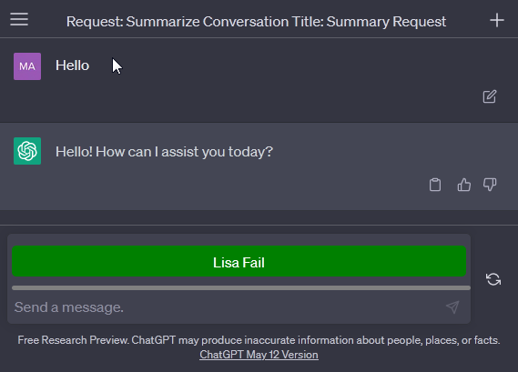

# Chat-GPT-Input
Suurema mahuga failide sisestamiseks Chat GPT  aknasse

## Kohaliku Firefox laiendi lisamine(extension)

1. Lae alla ChatGptInput.zip
2. Ava Firefoxis järngev aadress:

```
about:config
```

Kliki 'Accept the Risk and Continue'
Muuda järgnev valik 'xpinstall.signatures.required'  false

3. Ava Firefoxis järgnev aadress:

```
about:addons
```
Kliki hammasratta ikoonil
Vali 'Install Add-on from File...' ning vali laiend oma kohalikust arvutist ehk ChatGptInput.zip
See võimaldab lisada laiendeid järgnevates formaatides '.xpi', '.jar' and '.zip'


## Kasutusjuhend (ajutine)

*Kasutusjuhend:
1. Kopeerige 'Chat_GPT_Input.js' kood
2. Avage brauseris Chat GPT leht ning klikkige F12 (Avaneb 'web developers tools' aken)
3. Klikkige 'Console' peal (Avaneb brauseri konsool)
4. Kleepige kopeeritud kood konsooli (Ctrl+V), mispeale tekib Chat GPT aknasse nupp tekstiga "Lisa fail"
5. Antud nupul klikkides saab lisada ka suurema mahuga faile mis lihtsalt tükeldatakse väksemateks input'ideks.

## Toetatud formaadid:
* .txt
* .js
* .py
* .html
* .css
* .json
* .csv
* .cs
* .java

## Firefox laiendi loomine

Selleks lisatud:
* manifest.json
* PNG ikoonid resolutsiooniga: 16, 32, 48 ja 128 pikslit
